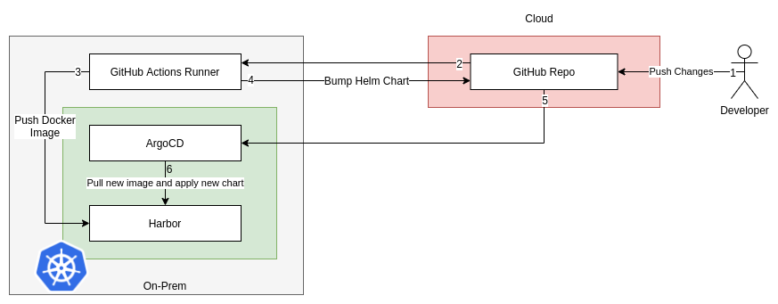

  

# What?
This project is a gitops proof of concept with multiple environments by using [ArgoCD](https://github.com/argoproj/argo-cd). 
By the way, I wanted to test Github Actions and some tools like trivy, snyk, codecov, chart-testing...

Below is the deployment architecture diagram:

# Todo
- [ ] Add automatic canary release
- [ ] Improve chart

# GitHub Actions
Give attention to these future hypothetic features which would make GA more attractive to my eyes:
* YAML anchors
* Private github actions
* Reusable workflows/jobs ?
* Working directory at job level
* Custom labels on self hosted runners
* CI skip
* Repository dispatch not only on master